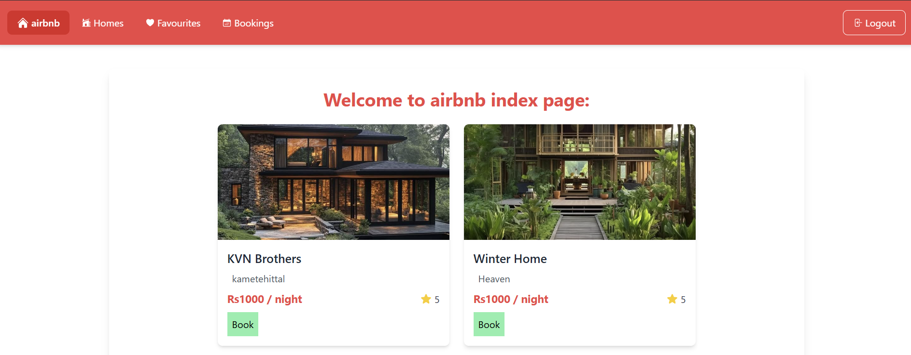
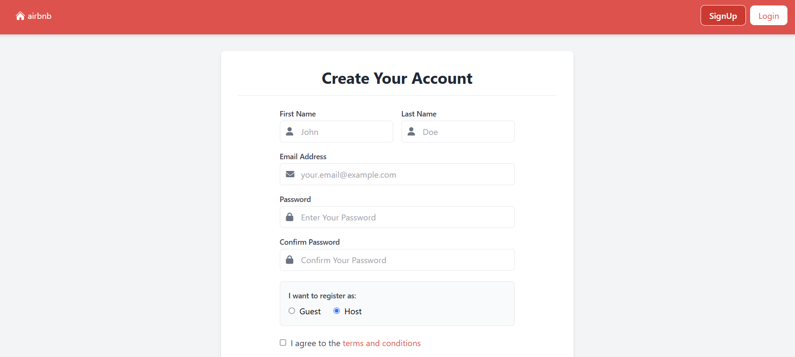
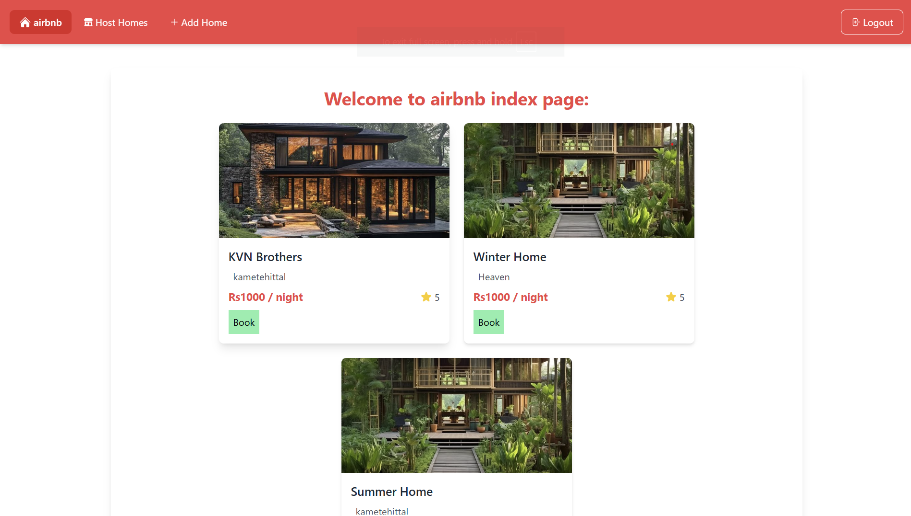

# 🏠 Airbnb Clone

A full-stack web application that replicates the core functionality of Airbnb, built with Node.js, Express, MongoDB, and EJS templating engine.




## ✨ Features

### 🔐 Authentication
- User registration and login system
- Session-based authentication
- Password encryption using bcryptjs
- User type differentiation (guest/host)

### 🏡 Property Management
- **For Hosts:**
  - Add new properties with details (name, price, location, rating, description)
  - Upload property photos
  - Edit existing properties
  - View all hosted properties
  - Delete properties

### 🏠 Property Browsing
- **For Guests:**
  - Browse all available properties
  - View property details
  - Add properties to favorites
  - View favorite properties list
  - Make reservations

### 🎨 User Interface
- Modern, responsive design using Tailwind CSS
- Clean and intuitive user interface
- Mobile-friendly layout
- Beautiful property cards with images

## 🛠️ Tech Stack

- **Backend:** Node.js, Express.js
- **Database:** MongoDB with Mongoose ODM
- **Frontend:** EJS templating engine
- **Styling:** Tailwind CSS
- **Authentication:** Express Session, bcryptjs
- **File Upload:** Multer
- **Validation:** Express Validator

## 📋 Prerequisites

Before running this application, make sure you have the following installed:

- [Node.js](https://nodejs.org/) (v14 or higher)
- [npm](https://www.npmjs.com/) (comes with Node.js)
- [MongoDB](https://www.mongodb.com/) (local or cloud instance)

## 🚀 Installation & Setup

1. **Clone the repository**
   ```bash
   git clone <repository-url>
   cd airbnb-Clone
   ```

2. **Install dependencies**
   ```bash
   npm install
   ```

3. **Configure MongoDB**
   - Update the MongoDB connection string in `app.js`:
   ```javascript
   const DB_PATH = "your-mongodb-connection-string";
   ```

4. **Start the development server**
   ```bash
   npm start
   ```
   This command will:
   - Start the Node.js server with nodemon
   - Watch and compile Tailwind CSS
   - Run both processes concurrently

5. **Access the application**
   - Open your browser and navigate to `http://localhost:3003`

## 📁 Project Structure

```
airbnb-Clone/
├── app.js                 # Main application entry point
├── package.json           # Project dependencies and scripts
├── tailwind.config.js     # Tailwind CSS configuration
├── controllers/           # Business logic controllers
│   ├── authController.js  # Authentication logic
│   ├── hostController.js  # Host-related operations
│   ├── storeController.js # Property browsing logic
│   └── errors.js         # Error handling
├── models/               # Database models
│   ├── user.js          # User schema
│   └── home.js          # Property schema
├── routes/              # Route definitions
│   ├── authRouter.js    # Authentication routes
│   ├── hostRouter.js    # Host-specific routes
│   └── storeRouter.js   # Property browsing routes
├── views/               # EJS templates
│   ├── auth/           # Authentication pages
│   ├── host/           # Host dashboard pages
│   ├── store/          # Property browsing pages
│   └── partials/       # Reusable template components
├── public/             # Static assets
│   ├── images/         # Static images
│   ├── home.css        # Custom styles
│   └── output.css      # Compiled Tailwind CSS
├── uploads/            # User-uploaded property images
└── utils/              # Utility functions
    └── pathUtil.js     # Path utility functions
```

## 🔧 Available Scripts

- `npm start` - Start the development server with Tailwind CSS watching
- `npm run tailwind` - Watch and compile Tailwind CSS
- `npm test` - Run tests (currently not implemented)

## 🎯 Key Features Explained

### User Authentication
- Secure user registration and login
- Session management with MongoDB store
- Password hashing for security
- User type-based access control

### Property Management
- CRUD operations for properties
- Image upload functionality
- Property search and filtering
- Favorites system

### Responsive Design
- Mobile-first approach
- Tailwind CSS for styling
- Clean and modern UI
- Optimized for all screen sizes

## 🔒 Security Features

- Password encryption using bcryptjs
- Session-based authentication
- Input validation using express-validator
- File upload restrictions (images only)
- CSRF protection through session management


## 🤝 Contributing

1. Fork the repository
2. Create a feature branch (`git checkout -b feature/amazing-feature`)
3. Commit your changes (`git commit -m 'Add some amazing feature'`)
4. Push to the branch (`git push origin feature/amazing-feature`)
5. Open a Pull Request

## 📝 License

This project is licensed under the ISC License.

## 👨‍💻 Author

*Sudarshan K Naik*

## 🙏 Acknowledgments

- Built as a learning project for web development
- Inspired by Airbnb's user interface and functionality
- Uses modern web development practices and technologies

---

**Note:** This is a demo project for educational purposes. Please ensure you comply with all applicable laws and regulations when using this code in production environments.
